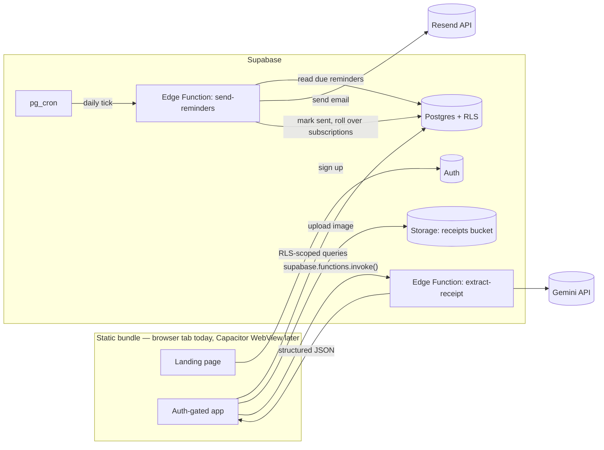

# Kept — Master Architecture & Build Specification

**Target agent:** GLM 5.2 (Zhipu/Z.ai — 1M context, coding/agent-tuned MoE model)
**Owner:** Nub Coder (solo dev, no art/marketing budget)
**Doc status:** Ready to build — replaces the previous "Vaultly" version in full
**Last updated:** July 19, 2026

> **Naming:** "Vaultly" was already in use, so this version renames the product **Kept** throughout — short, calm, and it reads naturally in-product ("Nothing kept yet," "3 things kept," "Kept safe"). Two backups if you still want options: **Covrd**, **Duekeep**. Whichever you land on, run your own domain/App Store/trademark check before locking it in — I checked for obvious collisions, but I can't do a real clearance search.

> **Companion doc:** `kept-design-system.md` — the full color/type/logo/animation spec. This document references it rather than repeating it. Starter logo and favicon files are attached alongside both docs.

---

## 0. Read This First — Agent Operating Rules

1. **This document is the single source of truth.** Stack and schema decisions are locked — flag it back before substituting anything.
2. **Every module below opens with a "Why this exists" line before the "what."** That's deliberate: understanding intent produces better judgment calls on the details this doc doesn't spell out. Read the why, not just the how.
3. **Build in the phase order in §17.** Don't start the landing page polish or the AI pipeline before core CRUD works.
4. Anything tagged `⚠️ DECISION NEEDED` is genuinely open — stop and ask rather than guessing.
5. Model IDs go stale fast — Google killed the entire Gemini 2.0 line on June 1, 2026 with weeks of notice. Verify `gemini-3.5-flash` is still current at `ai.google.dev/gemini-api/docs/models` before wiring up §7.
6. **For GLM 5.2 specifically:** 1M-token context means this whole doc plus the design doc can be loaded in one shot. It benchmarks especially well on frontend/design coding — lean on that for §8 and the design doc rather than defaulting to generic component boilerplate.

---

## 1. Product Overview

**One-liner:** Kept is a personal purchase vault — receipts, warranties, subscriptions, and bills in one place, with AI-assisted data entry and reminders before you lose money to a missed warranty claim or a forgotten renewal.

**Shape of the product now:** a public marketing landing page (§8) that explains the pitch and sells the sign-up, sitting in front of the authenticated app (dashboard, items, subscriptions, reminders, settings). Today it ships as a website. The same codebase is built, from the first line of code, so it can be wrapped as an Android APK via Capacitor later without a rewrite — see §3.

**Target users:** individuals and families managing personal purchases and subscriptions; secondarily freelancers/solo founders tracking tool subscriptions and hardware warranties.

**Core value loop:** land on the marketing page → sign up → snap a photo → AI fills in the form → user confirms → item is tracked → user gets reminded before it expires or renews.

---

## 2. Tech Stack (Locked)

| Layer | Choice | Why this and not the obvious alternative |
|---|---|---|
| Frontend framework | Next.js 15 (App Router), **static export** (`output: 'export'`) | Gives the landing page full SSG/SEO benefits *and* produces a plain HTML/JS/CSS bundle that Capacitor can wrap unchanged later. A normal (non-exported) Next.js app with Server Actions can't be bundled into Capacitor without a separate backend deployment — see §3. |
| Styling | Tailwind CSS + shadcn/ui | Design tokens are defined in `kept-design-system.md`, not shadcn defaults — don't ship unstyled primitives. |
| Icons | lucide-react | No art budget — icons + color + type carry all visual weight. |
| Landing page animation | GSAP + ScrollTrigger | Fully free since April 2025 (Webflow's acquisition of GreenSock ended the paid "Club GreenSock" tier) — no licensing cost, no caveat needed. See the design doc for the actual animation plan. |
| Auth / DB / Storage | Supabase (Postgres 15+, Auth, Storage) | Free tier covers Postgres, 1 GB storage, Auth, Edge Functions, and pg_cron. |
| AI (receipt extraction) | Google Gemini API — `gemini-3.5-flash`, called from a **Supabase Edge Function** (not a Next.js Route Handler — see §3 and §7) | |
| Scheduled jobs | Supabase `pg_cron` → Edge Function | Enabled by default on every Supabase project, free tier included. |
| Transactional email | Resend | Confirm current free-tier send volume at resend.com/pricing before committing — comfortably enough for a solo app's reminder volume, but verify the number rather than trusting a hardcoded assumption here. |
| Hosting (website) | Vercel (Hobby/free tier) | Serves the static export directly. |
| Packaging (later) | Capacitor | Wraps the same static build as an Android APK — see §3 and §16. |
| Image compression | `browser-image-compression` (client-side) | Keeps the 1 GB free storage tier viable much longer — see §6. |

---

## 3. Why This Architecture: Website Today, APK Tomorrow

**Why this module exists:** this is the section that makes the Capacitor requirement real instead of aspirational. Bolting Capacitor onto an app that was built with Server Actions and dynamic server routes means rebuilding the data layer later. Building it in from day one costs almost nothing extra now and saves a rewrite later.

**What static export changes, concretely:**

| Normal Next.js (what the old spec assumed) | This spec (static-export safe) | Why |
|---|---|---|
| Server Actions for writes | Supabase client SDK called directly from Client Components | Server Actions need a live Node server at request time. A statically exported bundle running inside a Capacitor WebView has no server behind it at all. |
| Route Handler (`/api/extract-receipt`) for the Gemini call | Supabase **Edge Function** (`supabase.functions.invoke()`) | Same reasoning — the Edge Function is a separately-hosted HTTPS endpoint that works identically whether the UI calling it is a browser tab on Vercel or a Capacitor WebView on a phone with no Vercel deployment in the picture at all. |
| `/items/[id]` dynamic route segment | `/items/detail?id=...` — a **static page that reads `id` from `useSearchParams()`** | Static export requires every route to be fully known at build time (`generateStaticParams`). Item IDs are created by users at runtime — they can't be pre-generated. A query param sidesteps this entirely since `/items/detail` itself is one static page. |
| Next.js Middleware for auth-gating routes | A client-side `<AuthGuard>` wrapper that checks `supabase.auth.getSession()` on mount and redirects if absent | Middleware requires an edge/server runtime that doesn't exist once the app is bundled into Capacitor. |
| `next/image` optimization | `images: { unoptimized: true }` in `next.config.js`, plain `` | The optimizer is a server feature; it silently can't run in a static/Capacitor context. |

**The payoff:** the exact same `out/` build directory that gets deployed to Vercel today becomes the `webDir` in `capacitor.config.ts` when you're ready to build the APK. One codebase, two shells, zero duplicated logic. Details on that later step are in §16 — don't build it now, just don't box yourself out of it.

---

## 4. System Architecture



**Why this shape:** every arrow into Supabase is a plain HTTPS call from the client — there is no "Kept server" anywhere in the diagram. That's the direct consequence of §3: nothing here cares whether it's running in a browser tab or a Capacitor shell.

---

## 5. Database Schema

**Why this module exists:** this is the shared source of truth for every screen in the app — the dashboard, the list, the reminders, the AI review form all read and write the same two tables. Getting the shape right once here avoids three different half-compatible data models emerging across features later.

**Why one `items` table instead of three:** a purchase, a subscription, and a bill are the same thing to the user — "something I need to track before it costs me money." Splitting them into `purchases`/`subscriptions`/`bills` tables would mean three near-identical schemas and a `UNION` every time the dashboard or search needs to show all of them together. One table with a `type` discriminator and nullable type-specific columns keeps the common 90% (name, amount, status, reminders) in one place and isolates the 10% that actually differs.

```sql
-- ============================================================
-- ENUMS
-- ============================================================
create type item_type as enum ('purchase', 'subscription', 'bill');
create type item_status as enum ('active', 'expiring_soon', 'expired', 'cancelled');
create type reminder_kind as enum ('warranty_expiry', 'subscription_renewal', 'bill_due');

-- ============================================================
-- PROFILES — why: timezone-correct reminders need somewhere to
-- store each user's IANA timezone, and Settings needs an email
-- opt-in toggle. Auto-created on signup so it's never missing.
-- ============================================================
create table public.profiles (
  id uuid primary key references auth.users(id) on delete cascade,
  display_name text,
  timezone text not null default 'UTC',
  email_reminders_enabled boolean not null default true,
  created_at timestamptz not null default now()
);

create function public.handle_new_user()
returns trigger
language plpgsql
security definer set search_path = public
as $$
begin
  insert into public.profiles (id, display_name)
  values (new.id, new.raw_user_meta_data->>'full_name');
  return new;
end;
$$;

create trigger on_auth_user_created
  after insert on auth.users
  for each row execute function public.handle_new_user();

create function public.set_updated_at()
returns trigger language plpgsql as $$
begin
  new.updated_at = now();
  return new;
end;
$$;

-- ============================================================
-- ITEMS — the core table. See rationale above.
-- ============================================================
create table public.items (
  id uuid primary key default gen_random_uuid(),
  user_id uuid not null references auth.users(id) on delete cascade,
  type item_type not null,
  status item_status not null default 'active',

  name text not null,
  merchant text,
  category text not null default 'other',   -- free text + client-side presets, no categories table for MVP

  amount numeric(12,2),
  currency text not null default 'USD',

  purchase_date date,
  warranty_months smallint,
  warranty_expiry date,

  billing_cycle text,               -- 'weekly' | 'monthly' | 'yearly'
  next_billing_date date,

  notes text,
  receipt_image_path text,          -- Storage object path, not a public URL — see §6
  ai_extracted jsonb,
  is_ai_extracted boolean not null default false,

  created_at timestamptz not null default now(),
  updated_at timestamptz not null default now(),

  constraint chk_purchase_fields check (
    type <> 'purchase' or purchase_date is not null
  ),
  constraint chk_subscription_fields check (
    type not in ('subscription','bill') or (billing_cycle is not null and next_billing_date is not null)
  )
);

create trigger items_set_updated_at
  before update on public.items
  for each row execute function public.set_updated_at();

-- ============================================================
-- REMINDERS — generated in application code (§10), not a DB
-- trigger, to keep scheduling logic in one language.
-- ============================================================
create table public.reminders (
  id uuid primary key default gen_random_uuid(),
  item_id uuid not null references public.items(id) on delete cascade,
  user_id uuid not null references auth.users(id) on delete cascade,
  kind reminder_kind not null,
  remind_on date not null,
  sent boolean not null default false,
  sent_at timestamptz,
  created_at timestamptz not null default now(),
  unique (item_id, kind, remind_on)
);

-- ============================================================
-- INDEXES — rationale in §12
-- ============================================================
create index idx_items_user_id        on public.items (user_id);
create index idx_items_user_status    on public.items (user_id, status);
create index idx_items_user_type      on public.items (user_id, type);
create index idx_items_warranty_exp   on public.items (warranty_expiry) where type = 'purchase';
create index idx_items_next_billing   on public.items (next_billing_date) where type in ('subscription','bill');
create index idx_reminders_due        on public.reminders (remind_on) where sent = false;
create index idx_reminders_user       on public.reminders (user_id);

create extension if not exists pg_trgm;
create index idx_items_name_trgm      on public.items using gin (name gin_trgm_ops);
create index idx_items_merchant_trgm  on public.items using gin (merchant gin_trgm_ops);

-- ============================================================
-- ROW LEVEL SECURITY — the only authorization layer in the app.
-- (select auth.uid()) instead of a bare auth.uid() lets Postgres
-- cache it once per statement instead of once per row — see §12.
-- ============================================================
alter table public.profiles  enable row level security;
alter table public.items     enable row level security;
alter table public.reminders enable row level security;

create policy "profiles_select_own" on public.profiles for select using (id = (select auth.uid()));
create policy "profiles_update_own" on public.profiles for update using (id = (select auth.uid()));

create policy "items_select_own" on public.items for select using (user_id = (select auth.uid()));
create policy "items_insert_own" on public.items for insert with check (user_id = (select auth.uid()));
create policy "items_update_own" on public.items for update using (user_id = (select auth.uid()));
create policy "items_delete_own" on public.items for delete using (user_id = (select auth.uid()));

create policy "reminders_select_own" on public.reminders for select using (user_id = (select auth.uid()));
create policy "reminders_insert_own" on public.reminders for insert with check (user_id = (select auth.uid()));
create policy "reminders_update_own" on public.reminders for update using (user_id = (select auth.uid()));
create policy "reminders_delete_own" on public.reminders for delete using (user_id = (select auth.uid()));

-- The daily cron Edge Function (§10) uses the SERVICE ROLE key
-- and bypasses RLS by design — the one place allowed to touch
-- every user's rows.
```

---

## 6. Storage Architecture

**Why this module exists:** receipt images are the one piece of user data that isn't a database row, and they're the thing most likely to blow through the free storage tier if handled carelessly.

- **Bucket:** `receipts` — private.
- **Path:** `{user_id}/{item_id}/{timestamp}-{filename}`. Generate the item's UUID client-side (`crypto.randomUUID()`) before upload, so the storage path and eventual DB row share the same ID.

```sql
insert into storage.buckets (id, name, public) values ('receipts', 'receipts', false);

create policy "receipts_select_own"
on storage.objects for select
using (bucket_id = 'receipts' and (storage.foldername(name))[1] = (select auth.uid())::text);

create policy "receipts_insert_own"
on storage.objects for insert
with check (bucket_id = 'receipts' and (storage.foldername(name))[1] = (select auth.uid())::text);

create policy "receipts_delete_own"
on storage.objects for delete
using (bucket_id = 'receipts' and (storage.foldername(name))[1] = (select auth.uid())::text);
```

**Two gotchas to build around from day one, not patch in later:**
1. **HEIC images.** iPhones default to HEIC, which most browsers won't render inline. Convert to JPEG client-side (`heic2any`) before upload.
2. **Storage budget.** Free tier is 1 GB. Compress client-side (`browser-image-compression`, ~1600px max width, ~80% JPEG quality) before upload — a raw phone photo can be 4–8 MB; compressed, it's closer to 200–400 KB, roughly a 15–20x runway extension for the same number of receipts.

---

## 7. AI Receipt Extraction Pipeline

**Why this module exists — and why it moved off Next.js:** this is the one piece of the app that touches a secret API key, so it can never run in the browser. In the original spec it lived in a Next.js Route Handler; here it's a **Supabase Edge Function** instead, purely because of §3 — a Route Handler only exists while a Next.js server is running, and once this ships as a Capacitor APK with no such server behind it, that endpoint would simply vanish. An Edge Function is a standalone HTTPS endpoint from day one, so the AI pipeline works identically whether it's called from a browser tab or a phone app.

**Flow:** user photographs/uploads a receipt → image uploaded to Storage → client calls the Edge Function with the storage path → function fetches the image, calls Gemini with a JSON schema → structured fields return → **user reviews and edits before saving — nothing is auto-saved from AI output.**

**The rule this pipeline must never break** (carried over from the original product discovery): *never let the AI infer or estimate a warranty period.* Most receipts don't print one. `warranty_months` stays `null` unless it's explicitly printed on the document — the UI always renders that field as empty-and-editable rather than AI-guessed, so a wrong guess never quietly becomes a saved fact.

```typescript
// supabase/functions/extract-receipt/index.ts
// Deno runtime. Invoked via supabase.functions.invoke('extract-receipt', {...})
// which automatically forwards the caller's JWT — no separate auth wiring needed.

const EXTRACTION_PROMPT = `You are extracting structured data from a photo of a receipt,
invoice, or subscription confirmation email screenshot.
Only return fields you can actually read from the image.
Do NOT guess or estimate a warranty period. Only set warranty_months if a warranty
duration is explicitly printed on the document. Otherwise return null for it.`;

const responseSchema = {
  type: "OBJECT",
  properties: {
    name:               { type: "STRING" },
    merchant:           { type: "STRING" },
    amount:             { type: "NUMBER" },
    currency:           { type: "STRING" },
    purchase_date:      { type: "STRING", description: "YYYY-MM-DD" },
    suggested_category: { type: "STRING" },
    suggested_type:     { type: "STRING", enum: ["purchase", "subscription", "bill"] },
    warranty_months:    { type: "INTEGER", nullable: true },
    confidence_note:    { type: "STRING", description: "Anything illegible or ambiguous" }
  },
  required: ["name", "merchant", "amount"]
};

Deno.serve(async (req) => {
  // 1. Extract + verify the caller from the forwarded Authorization header
  // 2. Rate-limit check — see below
  // 3. Fetch the image bytes from Storage using the path the client sends
  // 4. Call Gemini:
  const res = await fetch(
    `https://generativelanguage.googleapis.com/v1beta/models/gemini-3.5-flash:generateContent?key=${Deno.env.get("GEMINI_API_KEY")}`,
    {
      method: "POST",
      headers: { "Content-Type": "application/json" },
      body: JSON.stringify({
        contents: [{ parts: [{ text: EXTRACTION_PROMPT }, { inline_data: { mime_type: "image/jpeg", data: base64Image } }] }],
        generationConfig: { responseMimeType: "application/json", responseSchema }
      })
    }
  );
  // 5. Parse and return the JSON to the client for the review form.
  // 6. On any failure — return a clear error and let the client fall through
  //    to the manual-entry form. AI extraction accelerates the form; it's
  //    never a hard dependency for saving an item.
});
```

Secrets for an Edge Function are set via the Supabase CLI (`supabase secrets set GEMINI_API_KEY=...`), not a `.env.local` file — that file only ever holds the *public* Supabase URL/anon key on the Next.js side.

**Rate limiting:** before calling Gemini, count today's rows where `user_id = caller AND is_ai_extracted = true AND created_at::date = current_date`. Cap at ~20/day per user — generous for personal use, no Redis/Upstash required.

---

## 8. Landing Page

**Why this module exists:** everything from §5 onward assumed a signed-in user. Nobody arrives signed in — this is the page that has to explain the product and convert a stranger into a signup in one scroll. It's also the one page in the app that's allowed to be visually bold; see the design doc for why the dashboard deliberately isn't.

**Structure:**

| Section | Purpose | Notes |
|---|---|---|
| Hero | State the pitch in one line + the signature animated moment (design doc §6) + primary CTA | "Snap a receipt. Never lose a warranty or a subscription again." + `[Get started free]` |
| How it works | 3 steps: Snap → Confirm → Get reminded | A real sequence, so numbering it is earning its keep here (unlike decorative step numbers) |
| Feature grid | AI scan, warranty tracking, subscription tracking, reminders | 4 cards, icon + one line each, no illustration needed |
| Social proof / trust | Optional for MVP — skip if there are no users yet rather than faking testimonials | ⚠️ DECISION NEEDED if you want a placeholder here or to omit the section entirely pre-launch |
| Final CTA | Repeat the primary action | "Get started free" again, not a new message |
| Footer | Login link, minimal legal (privacy/terms placeholders), no clutter | |

**SEO:** because this page is statically generated (§3), it ships as fully-rendered HTML — set a real `<title>`, meta description, and Open Graph tags in `app/page.tsx`'s metadata export. This is free SEO you don't get once a page becomes client-only.

**Flow into the app:** CTA → `/signup` → on success, redirect straight to `/dashboard`. Existing users landing on `/` get a "Log in" link in the header, not a second marketing pitch.

---

## 9. Core Feature Specs

**Why this module exists:** the schema and pipeline above are the substrate; this is what a user actually taps through. Route paths below use the query-param pattern from §3 — flag it if any of these need a URL a user would realistically bookmark or share, since that's the one case where the dynamic-segment approach would normally be nicer and a workaround is worth discussing.

### 9.1 Dashboard (`/dashboard`)
Summary cards (single RPC call — §12), a "coming up" list of the next 5 reminders, and the last 6 items added.

### 9.2 Add Item (`/items/new`)
Two entry points — **Scan** (photo → AI extract → review form) and **Manual** (blank form) — that converge on the same form component, since AI just pre-fills it. Category is a combobox: presets (`Electronics`, `Appliances`, `Furniture`, `Subscriptions`, `Bills`, `Other`) plus free text. Type toggle (`purchase`/`subscription`/`bill`) changes which fields render. Saving triggers reminder generation (§10) in the same write.

### 9.3 Item List / Search (`/items`)
Filters: type, category, status. Search hits the trigram indexes (§12). **Keyset pagination**, not offset — see §12; this is the highest-growth table in the app.

### 9.4 Item Detail (`/items/detail?id=...`)
Full view/edit, receipt image with lightbox/zoom, delete with confirm, reminder history for that item.

### 9.5 Subscriptions (`/subscriptions`)
Filtered `type = 'subscription'` view, running monthly-equivalent total (yearly ÷ 12 for the total; shown as-is per row).

### 9.6 Reminders Center (`/reminders`)
In-app list of upcoming and past reminders — the fallback for anyone who's turned off email reminders in Settings.

### 9.7 Settings (`/settings`)
Email toggle, timezone (defaulted from `Intl.DateTimeFormat().resolvedOptions().timeZone` at signup, editable after), CSV export of items (MVP-simple; full account export is post-MVP, §19).

---

## 10. Reminders & Notifications System

**Why this module exists:** the entire value proposition ("never lose a warranty or a subscription again") lives in this module. Everything else in the app is bookkeeping; this is the part that actually saves the user money without them doing anything.

**Generation (application code, run right after an item is created or updated):**

```typescript
// lib/reminders.ts
const WARRANTY_WINDOWS_DAYS = [30, 7];
const RENEWAL_WINDOW_DAYS = 3;

async function syncRemindersForItem(supabase: SupabaseClient, item: Item) {
  // Clear only *unsent* future reminders for this item, then regenerate.
  // Sent reminders are never touched — they're the audit trail.
  await supabase.from('reminders').delete().eq('item_id', item.id).eq('sent', false);

  const rows: ReminderInsert[] = [];

  if (item.type === 'purchase' && item.warranty_expiry) {
    for (const days of WARRANTY_WINDOWS_DAYS) {
      rows.push({ item_id: item.id, user_id: item.user_id, kind: 'warranty_expiry',
                  remind_on: subDays(item.warranty_expiry, days) });
    }
  }
  if ((item.type === 'subscription' || item.type === 'bill') && item.next_billing_date) {
    rows.push({ item_id: item.id, user_id: item.user_id,
                kind: item.type === 'subscription' ? 'subscription_renewal' : 'bill_due',
                remind_on: subDays(item.next_billing_date, RENEWAL_WINDOW_DAYS) });
  }

  const future = rows.filter(r => r.remind_on >= todayISO());
  if (future.length) await supabase.from('reminders').upsert(future, { onConflict: 'item_id,kind,remind_on' });
}
```

**Daily cron (Edge Function, triggered by `pg_cron`):**

```sql
select cron.schedule(
  'send-daily-reminders', '0 7 * * *',
  $$ select net.http_post(
       url := 'https://<project-ref>.supabase.co/functions/v1/send-reminders',
       headers := jsonb_build_object('Authorization', 'Bearer ' || '<service-role-key-from-vault>')
     ); $$
);
```

Edge Function logic:
1. Query due, unsent reminders **against each user's local date**, not server UTC: `remind_on <= (now() at time zone p.timezone)::date`, joined to `profiles`. A naive UTC-only comparison sends reminders a day early or late for anyone outside UTC.
2. Group by user, send **one email per user** per day listing all due items — not one email per reminder.
3. Mark sent rows `sent = true, sent_at = now()`.
4. **Subscription rollover:** for any `subscription`/`bill` where `next_billing_date < today`, advance it by one `billing_cycle` interval and re-run the sync logic so the *next* cycle's reminder gets created. Skip this and a subscription's reminders silently stop after the first renewal.

> ⚠️ **Free-tier gotcha:** Supabase free projects can pause after a period of inactivity. A once-daily cron hit generally keeps a project active, but if reminders silently stop firing, check the project isn't paused before debugging application logic.

---

## 11. Auth & Security

**Why this module exists:** RLS (§5) is the actual security boundary — this module is about not accidentally undermining it.

- **Supabase Auth**, email/password for MVP. Google OAuth is a cheap add later if signup friction becomes a problem.
- **Client-side route guard, not middleware** (§3): a shared `<AuthGuard>` in the layout for every page under the authenticated section checks `supabase.auth.getSession()` on mount, subscribes to `onAuthStateChange`, and redirects to `/login` if there's no session.
- **RLS is the only authorization layer** — no parallel permission checks in application code to keep in sync.
- **Secrets never reach the client:** `GEMINI_API_KEY`, `RESEND_API_KEY`, and the Supabase **service role** key live only in Edge Function secrets, never in `NEXT_PUBLIC_*` variables. Only the `anon` key and URL are public — safe by design because RLS, not key secrecy, is what protects the data.
- **The extraction endpoint is the one abuse surface** (it costs real money per call) — the §7 rate limit and auth check are both non-optional.

---

## 12. Query Optimization Guidelines

**Why this module exists:** none of this matters at 20 test rows. It all matters at 2,000 real ones, and retrofitting it after the fact means migrating a live user's data — cheaper to build it right the first time.

| Index | Why |
|---|---|
| `(user_id)` on items/reminders | Every RLS policy filters on this — the single most-hit predicate in the app |
| `(user_id, status)`, `(user_id, type)` | Dashboard and list filters combine these; composite index avoids a second lookup |
| Partial index on `warranty_expiry where type='purchase'` | The cron scan only ever touches purchase rows for this field |
| `gin_trgm_ops` on `name`/`merchant` | Powers the search bar (§9.3) without a separate search service |
| Partial index on `reminders.remind_on where sent=false` | The daily cron's core query — sent rows are permanently irrelevant to it |

**RLS performance:** every policy wraps `auth.uid()` as `(select auth.uid())` (already done in §5) so Postgres caches it once per statement instead of re-evaluating per row.

**Keyset pagination, not `OFFSET`:**
```typescript
// first page
supabase.from('items').select('id,name,merchant,amount,status,created_at')
  .eq('user_id', userId)
  .order('created_at', { ascending: false }).order('id', { ascending: false })
  .limit(20);

// next page — cursor = last row of the previous page
supabase.from('items').select('id,name,merchant,amount,status,created_at')
  .eq('user_id', userId)
  .or(`created_at.lt.${cursor.createdAt},and(created_at.eq.${cursor.createdAt},id.lt.${cursor.id})`)
  .order('created_at', { ascending: false }).order('id', { ascending: false })
  .limit(20);
```

**One round trip for the dashboard, not four:**
```sql
create or replace function public.get_dashboard_summary()
returns table (
  active_count bigint, expiring_soon_count bigint, expired_count bigint,
  subscription_monthly_total numeric, next_reminder_date date
)
language sql security invoker as $$
  select
    count(*) filter (where status = 'active'),
    count(*) filter (where status = 'expiring_soon'),
    count(*) filter (where status = 'expired'),
    coalesce(sum(amount) filter (where type = 'subscription' and billing_cycle = 'monthly' and status != 'cancelled'), 0),
    (select min(remind_on) from public.reminders r where r.user_id = auth.uid() and r.sent = false)
  from public.items where user_id = auth.uid();
$$;
```
`security invoker`, not `security definer` — RLS still applies to the caller; the explicit `where` is defense-in-depth on top of it, not a replacement.

**Avoid N+1 on item detail:** fetch an item and its reminders in one call via `items(*, reminders(*))` rather than a second round trip.

**Before shipping any new query that touches `items` at scale, run `EXPLAIN ANALYZE` on it.**

---

## 13. UI/UX & Branding

**Why this module exists — and why it's short here:** the full color system, typography, logo construction, the "stamp" signature element, and the GSAP animation plan all live in **`kept-design-system.md`**. Read that in full before building any screen. What follows is only the minimum reference needed while coding.

- CSS variables: `--paper`, `--surface`, `--ink`, `--ink-muted`, `--border`, `--accent`, `--status-active`, `--status-expiring`, `--status-expired`, `--status-cancelled` — exact hex values in the design doc.
- Type: Geist (UI/body), Geist Mono with tabular figures (money and dates only — nowhere else).
- The dashboard is deliberately calm/restrained; the landing page is deliberately bolder. That split is intentional, not inconsistent — see the design doc for why.
- No purple anywhere in the palette. This is a hard constraint, not a stylistic default.
- Dark mode via `next-themes` — build it in the initial UI pass, not bolted on later.
- Quality floor: responsive to mobile width, visible keyboard focus rings, `prefers-reduced-motion` respected on every transition including the GSAP work.

---

## 14. Folder Structure

```
kept/
├── app/
│   ├── page.tsx                       # "/" — landing page
│   ├── login/page.tsx
│   ├── signup/page.tsx
│   ├── (app)/
│   │   ├── layout.tsx                 # wraps children in <AuthGuard>
│   │   ├── dashboard/page.tsx
│   │   ├── items/
│   │   │   ├── page.tsx               # list + search + filters
│   │   │   ├── new/page.tsx
│   │   │   └── detail/page.tsx        # reads ?id= via useSearchParams — not [id]
│   │   ├── subscriptions/page.tsx
│   │   ├── reminders/page.tsx
│   │   └── settings/page.tsx
│   └── layout.tsx
├── components/
│   ├── ui/                            # shadcn primitives
│   ├── landing/                       # Hero, HowItWorks, FeatureGrid
│   ├── items/                         # ItemCard, StatusStamp, ItemForm
│   ├── dashboard/
│   └── auth-guard.tsx
├── lib/
│   ├── supabase/
│   │   └── client.ts                  # the only Supabase client — browser-safe, used everywhere
│   ├── reminders.ts                   # §10 sync logic
│   └── gsap/                          # animation setup, respects prefers-reduced-motion
├── supabase/
│   ├── migrations/
│   └── functions/
│       ├── extract-receipt/index.ts   # §7
│       └── send-reminders/index.ts    # §10
├── public/
│   ├── favicon.ico
│   ├── favicon.svg
│   ├── apple-touch-icon.png
│   └── icons/ (192, 512 — manifest icons)
├── next.config.js                     # output: 'export', images.unoptimized: true
└── ...
```

---

## 15. Environment Variables

| Variable | Scope | Notes |
|---|---|---|
| `NEXT_PUBLIC_SUPABASE_URL` | Public | Safe — RLS protects the data, not key secrecy |
| `NEXT_PUBLIC_SUPABASE_ANON_KEY` | Public | Same as above |
| `SUPABASE_SERVICE_ROLE_KEY` | Edge Function secret only | Set via `supabase secrets set` — never in any `.env` shipped to the client |
| `GEMINI_API_KEY` | Edge Function secret only | `extract-receipt` function only |
| `RESEND_API_KEY` | Edge Function secret only | `send-reminders` function only |

---

## 16. Capacitor Packaging Path (Later — Not Part of This Build)

**Why this section exists, and why it's deliberately brief:** you don't need to touch this to ship the MVP. It exists so whoever builds the MVP (GLM 5.2, today) makes choices that don't box out this step later — which is exactly what §3 already did. When you're actually ready:

1. `npm install @capacitor/core @capacitor/cli @capacitor/android`
2. `npx cap init` — `webDir: 'out'` (the static export output)
3. `next build` (produces `out/`) → `npx cap add android` → `npx cap sync`
4. Open in Android Studio, set the app icon from `icon-512.png` (already generated — see the design doc), sign, build the APK.
5. Anything that assumed `window`/browser-only APIs should already be fine, since the whole app is already client-rendered per §3. Double-check any code that assumes a Vercel-hosted absolute URL (e.g., OAuth redirect URLs) — those need to point at the Supabase-hosted Auth flow, not a Vercel domain, once there's no guaranteed web host in the loop.

That's it — this is a packaging step, not an architecture change, because the architecture already accounted for it.

---

## 17. Build Order (Phased)

| Phase | Scope | Done when |
|---|---|---|
| **0** | Repo scaffold, Next.js (static export configured from the start) + Tailwind + shadcn, Supabase project created, env vars wired | `npm run dev` shows a blank shadcn-styled page; `next build` with `output: 'export'` succeeds |
| **1** | Full schema (§5) as migrations, RLS, storage bucket + policies (§6) | Insert/select a test row via the Supabase dashboard respecting RLS |
| **2** | Auth: signup, login, `<AuthGuard>`, profile auto-creation trigger | New signup produces a `profiles` row automatically; protected routes redirect when logged out |
| **3** | Landing page (§8) — structure and copy, no animation yet | All sections render, CTA routes to `/signup` |
| **4** | Core CRUD for items — manual entry only, no AI — list, detail, dashboard skeleton, keyset pagination, query-param detail route | Add/edit/delete an item end-to-end, see it on dashboard and list |
| **5** | AI extraction pipeline (§7) as a Supabase Edge Function | Photo → prefilled review form → save, graceful fallback to blank form on failure |
| **6** | Reminders: generation logic (§10), Edge Function, pg_cron schedule, Resend | A manually-inserted reminder with `remind_on = today` gets emailed on the next cron tick |
| **7** | Full design system pass (`kept-design-system.md`) applied everywhere, including the GSAP landing page animation | Every screen uses the real tokens and the `StatusStamp` component; landing hero animates; `prefers-reduced-motion` respected |
| **8** | Edge cases: HEIC conversion, image compression, timezone verification, mobile pass, `next build` static-export sanity check | HEIC upload renders correctly; non-UTC test account gets reminders on the right local day; static export builds clean with zero Server Action / dynamic-route errors |

---

## 18. Definition of Done — MVP

- [ ] Landing page live at `/`, converts to `/signup`
- [ ] Email/password signup + login
- [ ] Add item via photo (AI-assisted, via Edge Function) and via manual form
- [ ] Warranty field never auto-filled by AI — always user-confirmed
- [ ] Dashboard: active/expiring/expired counts + subscription monthly total (single RPC call)
- [ ] Item list: search, filter, keyset-paginated
- [ ] Item detail via `?id=` query param, not a dynamic segment
- [ ] Subscriptions view with running monthly total
- [ ] Warranty reminders at 30/7 days; subscription/bill reminders at 3 days
- [ ] Daily email digest (one per user) via Resend
- [ ] Subscription `next_billing_date` auto-rolls-over after each cycle
- [ ] Settings: timezone, email toggle
- [ ] Dark mode
- [ ] `next build` with `output: 'export'` succeeds with no errors — this is the litmus test that Capacitor packaging will work later
- [ ] Fully responsive, HEIC-safe, images compressed client-side, no purple anywhere in the UI

---

## 19. Post-MVP Backlog

- The actual Capacitor Android build + Play Store submission (§16)
- Budgeting / spend analytics across all tracked items
- Push notifications (in addition to email)
- User-configurable reminder windows (currently fixed at 30/7/3 days)
- Multi-currency conversion for the dashboard total
- Family/shared vault (multiple users on one set of items)
- Browser extension to auto-capture subscription confirmation emails
- Full account data export (currently CSV-only)
- OCR fallback for receipts Gemini can't parse confidently
- iOS packaging via Capacitor, once Android is validated
